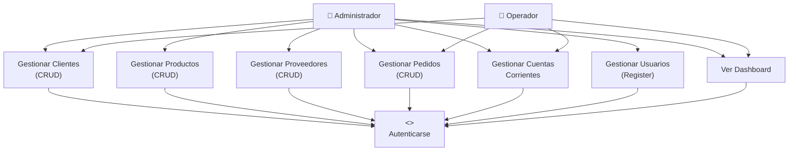
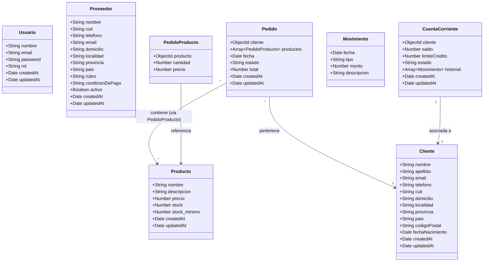
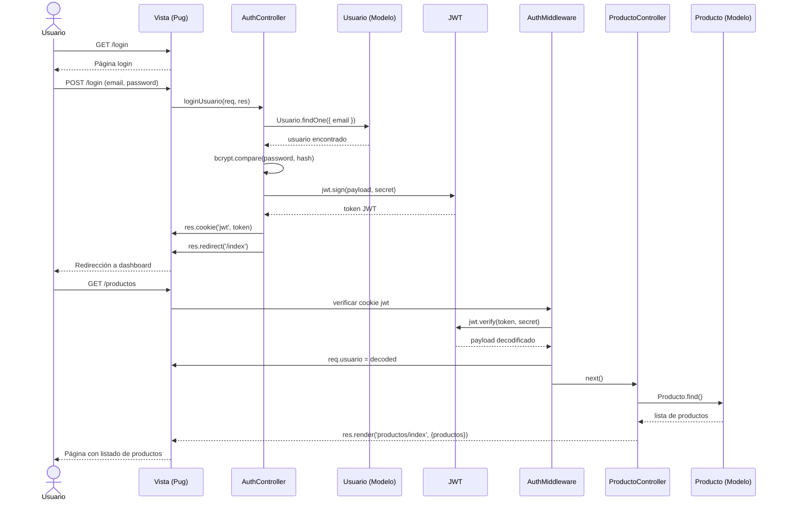
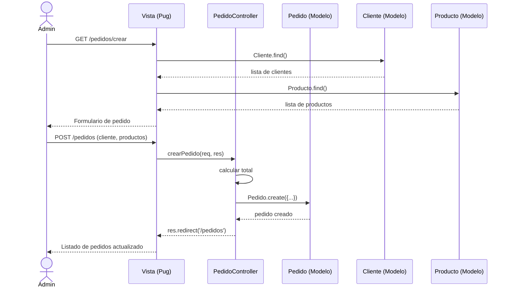
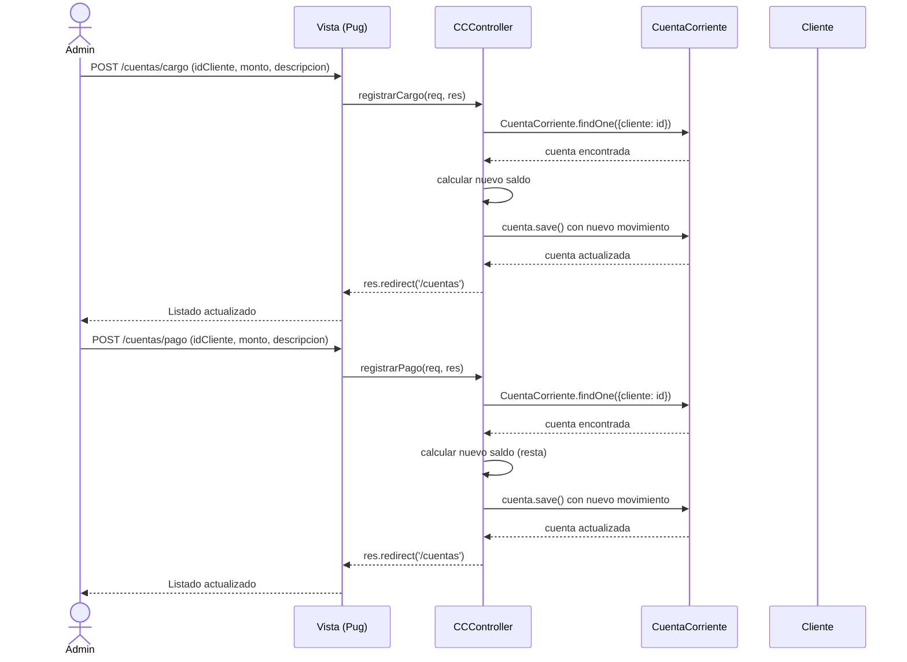

# Diagramas UML - TodoStock S.A.

## 1. Diagrama de Casos de Uso



---

## 2. Diagrama de Clases



---

## 3. Diagrama de Secuencia - Login y Consulta de Productos



---

## 4. Diagrama de Secuencia - Creación de Pedido



---

## 5. Modelo Entidad-Relación (DER)

```mermaid
erDiagram
    USUARIO {
        ObjectId id PK
        string nombre
        string email UK
        string password
        string rol "admin | operador"
        date createdAt
        date updatedAt
    }

    CLIENTE {
        ObjectId id PK
        string nombre
        string apellido
        string email UK
        string telefono
        string cuit UK
        string domicilio
        string localidad
        string provincia
        string pais
        string codigoPostal
        date fechaNacimiento
        date createdAt
        date updatedAt
    }

    PRODUCTO {
        ObjectId id PK
        string nombre
        string descripcion
        number precio
        number stock
        number stock_minimo
        date createdAt
        date updatedAt
    }

    PROVEEDOR {
        ObjectId id PK
        string nombre
        string cuit UK
        string telefono
        string email
        string domicilio
        string localidad
        string provincia
        string pais
        string rubro
        string condicionDePago
        boolean activo
        date createdAt
        date updatedAt
    }

    PEDIDO {
        ObjectId id PK
        ObjectId cliente FK
        date fecha
        string estado "pendiente | aprobado | enviado | entregado | cancelado"
        number total
        date createdAt
        date updatedAt
    }

    PEDIDO_PRODUCTO {
        ObjectId producto FK
        number cantidad
        number precio
    }

    CUENTA_CORRIENTE {
        ObjectId id PK
        ObjectId cliente FK UK
        number saldo
        number limiteCredito
        string estado "activo | con_deuda"
        date createdAt
        date updatedAt
    }

    MOVIMIENTO {
        date fecha
        string tipo "PAGO | CARGO"
        number monto
        string descripcion
    }

    CLIENTE ||--o{ PEDIDO : "tiene"
    PEDIDO ||--|{ PEDIDO_PRODUCTO : "contiene"
    PEDIDO_PRODUCTO }|--|| PRODUCTO : "referencia"
    CLIENTE ||--o| CUENTA_CORRIENTE : "posee"
    CUENTA_CORRIENTE ||--o{ MOVIMIENTO : "registra"
```

---

## 6. Diagrama de Secuencia - Cargo/Pago en Cuenta Corriente


